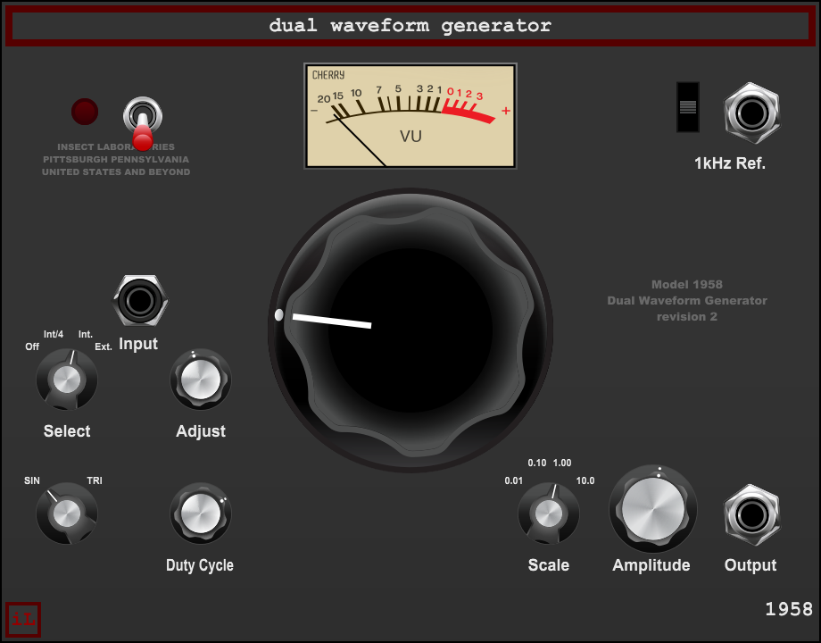

# 1958 Dual Waveform Generator — User Manual

**Version 2.0.0 · Voltage Modular · Wardenclyffe Station**

The 1958 Dual Waveform Generator is a precise sine and variable-triangle test oscillator with manual frequency bands, internal or external FM, a separate 1 kHz reference, and a physical POWER switch. Its sound is intended to stay clear and useful for measurement-style patches, with restrained drift and compression at high output levels.

This guide describes version 2.0.0. Open `nineteenfiftyeight.vmod` in Voltage Module Designer to build the module.

## Main oscillator

| Control or jack | Function |
| --- | --- |
| WAVEFORM | Selects sine or the triangle family. DUTY CYCLE affects triangle only. |
| DUTY CYCLE | Moves the triangle toward rising ramp on one side and falling saw on the other. It is smoothed to reduce zippering. |
| SCALE | Selects one of four overlapping frequency bands. |
| FREQUENCY | Tunes across the active SCALE band. |
| AMPLITUDE | Sets the main output from silence to a hot test signal, up to a nominal 10 V peak before compression. |
| MAIN OUT | Main waveform output; may also contain the mixed reference tone. |

| SCALE position | Main oscillator range |
| ---: | ---: |
| 1 | 0.1–10 Hz |
| 2 | 1–100 Hz |
| 3 | 10–1,000 Hz |
| 4 | 100–10,000 Hz |

The AMPLITUDE path is clean through about 5 V peak. Above that, compression and nonlinearities rise progressively toward the maximum output. The VU meter is averaged for readability; it is not a calibration meter.

## FM

| Control or jack | Function |
| --- | --- |
| FM SELECT | OFF, INT/4, INT or EXT. INT/4 uses reduced internal modulation; INT uses the full internal triangle oscillator; EXT uses the patched FM input. |
| FM ADJUST | In INT/4 or INT, sets internal modulation rate over approximately 0.05–50 Hz. In EXT, attenuates the external modulation input. |
| EXT FM | External frequency-modulation input. At maximum EXT depth, ±5 V gives about ±18% carrier deviation. |

The internal modulator is a triangle oscillator with a less precise character than the main oscillator. It has no separate output jack. Select OFF when you want the carrier alone. The modulation oscillator does not use the main FREQUENCY scale.

## 1 kHz reference and POWER

The reference oscillator is a clean 1,000 Hz sine, separate from the main waveform. The three-position **REFERENCE** switch works as follows:

| Switch position | Result |
| --- | --- |
| Up | The dedicated REF TONE jack outputs the reference at a useful fixed level. |
| Center | The reference is off. |
| Down | The reference is mixed into MAIN OUT at approximately 1.0 V peak before the main output stage. |

The reference’s level and pitch are independent of the main oscillator’s waveform and FM settings. It is useful for a steady test tone or as a reference mixed under the main signal.

The front-panel POWER switch applies an 8 ms fade. Powering down fades the signal to silence before stopping the oscillators; powering up resumes them through a fade. Host bypass is separate: it immediately silences the source and freezes state to save CPU. A brief artifact is possible when host bypass changes because it is not the declicked panel POWER transition.

## Example patches

**Set a sine test tone.** Select sine, choose a SCALE band that contains the target, tune with FREQUENCY, and set AMPLITUDE to the desired peak level.

**Shape a triangle.** Select the triangle family and sweep DUTY CYCLE from triangle toward ramp or saw. Return to the sine setting to hear that DUTY CYCLE does not affect it.

**Add controlled FM.** Select INT/4 for restrained internal motion or INT for the full internal range. For external FM, select EXT, patch to EXT FM, and use FM ADJUST as the input attenuator.

**Use the reference tone.** Select the up position for REF TONE only, center to turn it off, or down to add it to the main output.

The [1.0.2 release record](../1.0.2/README.md) documents the saved version and the final power-switch change.
