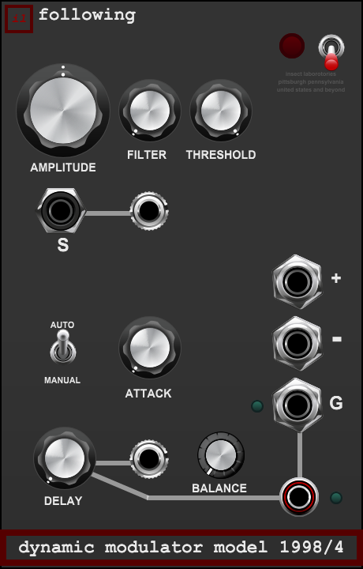

# Following — Dynamic Modulator Model 1998/4

## User manual · version 1.0.0

Following extracts the changing level of a mono audio signal and turns it into an envelope
and gates. Its shared input amplifier can be driven into compression, and that character
is available as audio at SIGNAL THROUGH. A true envelope delay and a linear BALANCE
control let you combine immediate movement with a later copy.

Use the envelopes to control SIGPROC or another VCA, a filter, or another modulation
destination. Following does not contain a second carrier input or an internal VCA for
applying the envelope to another signal. It supplies the control voltages for that patch.



## Quick start

1. Patch audio into **S** and turn the power switch up. It initially loads OFF.
2. Monitor the small **SIGNAL THROUGH** jack beside S. AMPLITUDE at noon is unity
   gain before the circuit's coloration; clockwise adds gain and increasingly compresses
   the audio. Fully counterclockwise silences the input amplifier.
3. Patch **+** to a modulation input or a VCA's control input. The default BALANCE gives
   the immediate envelope. Use **−** for the same envelope with reversed polarity.
4. Lower THRESHOLD from its 5 V startup setting until **G** opens on the events you want.
   The lamp beside G indicates the gate's actual state.
5. Increase DELAY and move BALANCE clockwise to hear the control movement occur later.
   The two delayed courtesy outputs always provide the delayed signals independently of BALANCE.

SIGNAL THROUGH is a tap after the input amplifier. If you need a clean copy of the
original audio, split it before Following. This is an intentional part of the instrument:
using its amplifier as a convenient audio path also gives you its gain and driven sound.

## Signal flow

```text
S → AMPLITUDE gain → driven amplifier ┬→ SIGNAL THROUGH
                                    └→ FILTER → envelope extraction
                                                ├→ immediate gate → G + lamp
                                                ├→ immediate envelope ─┐
                                                └→ DELAY ──────────────┤ BALANCE → + and −
                                                       ├→ delayed envelope courtesy
                                                       └→ delayed gate courtesy + lamp
```

The detector rectifies the filtered signal and follows its level. AUTO or MANUAL controls
the rise; both modes use the same two-stage, program-dependent release. THRESHOLD converts
the envelope into a sustained gate. It does not remove quieter portions of the envelope.

The detector FILTER, attack/release, THRESHOLD, DELAY and BALANCE do not process the
audio at SIGNAL THROUGH. Only the shared gain and driven amplifier shape that audio.

## Controls

### AMPLITUDE

Unipolar input gain runs from **0× to 4×**, with **1× at noon**. The taper devotes more
travel to lower gains. The control feeds both the audio output and the detector.

The amplifier has a smooth compression knee beginning at approximately **±3.5 V** after
gain and approaches a soft **±8.5 V** ceiling. At ordinary levels its gain is predictable;
driving it harder rounds peaks, changes the audio timbre, and compresses the envelope
presented to the detector. There is no separate output trim or automatic loudness matching.
Gain and drive therefore interact deliberately. Use downstream attenuation when needed.

This stage uses the Laboratory family's lightweight 2× midpoint processing and a gentle
high-frequency roll-off. It is a voiced circuit model, not an exact reconstruction of
historical components or a guarantee of alias-free distortion at extreme frequencies.

### FILTER

A **20–200 Hz**, logarithmic, one-pole high-pass acts only on the detector branch.
Start low to include more bass in the envelope. Raise it when low-frequency energy is
dominating the tracking or when you want the detector to respond more to attacks and
higher-frequency material. SIGNAL THROUGH retains its full-band amplifier output.

### THRESHOLD

A logarithmic **0–5 V** threshold sets when the gate opens. It is measured against the
extracted envelope, after input gain, filtering and envelope response. Increasing
AMPLITUDE can therefore make the same source open the gate more readily.

The main G output uses the immediate envelope; the delayed gate uses the delayed
envelope. Neither gate depends on BALANCE. Both outputs are **0 V low / +5 V high**.
They remain high while the envelope satisfies the threshold condition, rather than
issuing a short pulse on each crossing.

A small hysteresis band, normally about **25 mV**, keeps the gate from rapidly toggling
at the threshold. At the bottom of the dial, a very small floor rejects exact silence;
the circuit opens at approximately 1 mV and closes at approximately 0.5 mV. These floors
are implementation details for stable gating, not calibrated instrument specifications.

The default is **5 V**, the top of the range. An ordinary signal at unity AMPLITUDE may
not reach it. Lower THRESHOLD or drive the input harder when setting up a gate patch.

### AUTO / MANUAL and ATTACK

The switch loads in **AUTO, up**. AUTO chooses its attack response from the incoming
signal, using approximately **0.2–4 ms** time constants. It reacts quickly to substantial
new transients and more gently as the envelope approaches the signal level.

With the switch down in **MANUAL**, ATTACK sets a logarithmic **0.2 ms–1 s** time constant.
Fast settings follow attacks closely. Slower settings suppress sharp beginnings and can
turn sufficiently sustained input into a rising swell. A very short input may end before
a slow attack has risen far. The ATTACK knob retains its setting in AUTO but does not
control the automatic response.

The release is shared by both modes. It starts with a moderately fast decay and eases
into a slower tail. Recent signal level and duration affect the recovery: stronger or
sustained material generally releases more slowly than brief or weaker events. The
underlying time constants span roughly **25–90 ms** for the fast part and **150–650 ms**
for the tail. These are not fixed segment durations or times to complete silence.

### DELAY

DELAY shifts the **complete extracted envelope** by **0–3 seconds**. Its logarithmic
taper provides more space for short delays. It does not add a hold or extend release.
At a fixed setting, the delayed envelope has the same contour as the immediate envelope,
only later. The delayed gate uses the same threshold on that later envelope.

Turning DELAY moves the read position smoothly. While it is moving, the envelope's
timeline briefly expands or contracts, like changing the time of a running delay.
Allow it to settle when comparing exact gate timing. After loading, powering up or
resuming from host bypass, the delay starts empty; it does not replay older activity.

### BALANCE

BALANCE is a **linear blend** used by the main + and − outputs:

- Fully counterclockwise: immediate envelope only.
- Noon: half immediate plus half delayed.
- Fully clockwise: delayed envelope only.

There is no equal-power boost at the middle. At zero delay, both envelope copies coincide,
so moving BALANCE leaves the settled output level unchanged. At a nonzero delay, the
two contours overlap differently, which is the intended effect.

BALANCE does not alter SIGNAL THROUGH, G, or either delayed courtesy output.

## Jack and indicator reference

| Jack or lamp | Signal |
|---|---|
| S | Mono audio input to the shared amplifier. |
| Small jack beside S | SIGNAL THROUGH: post-gain, post-coloration audio before detector filtering. |
| + | Main blended envelope, 0 to +5 V. |
| − | Exact inverted main envelope, 0 to −5 V. |
| G | Sustained 0/+5 V gate from the immediate envelope. |
| Lamp beside G | On while G is high. |
| Small jack beside DELAY | Delayed envelope only, 0 to +5 V. |
| Small ringed jack below G | Delayed gate, 0/+5 V. |
| Lamp beside delayed gate | On while the delayed gate is high. |
| Red lamp by power | Panel power state. |

Gate indicators follow the output state without pulse stretching. Very short events may
be less visible at the host's display refresh rate even though the gate signal is present.
Envelope limiting occurs before the delayed copy is stored. The negative output always
mirrors the final positive output rather than providing a separately shaped detector.

## Power, bypass and saved patches

Panel power is **down/OFF, up/ON**. Audio and envelope outputs fade over approximately
5 ms on power changes. Gates and their lamps go low immediately on power-off. Once fully
off, the detector and delay history are cleared and all outputs are silent.

Host BYPASS follows the collection's direct routing convention: S reaches SIGNAL THROUGH
sample-for-sample without gain, coloration or smoothing. Envelope and gate outputs,
including their courtesy outputs, are silent. Gate lamps are dark. DSP histories do not
advance. Returning from bypass adopts current settings, clears old detector/delay history,
and begins with the short power fade if panel power is on.

The audio-through bypass is an intentional exception to silent courtesy outputs: it is
the module's primary audio route. Panel power and host bypass serve different purposes.

The host stores control settings. Following does not serialize the running envelope,
gate state or delay contents as an audio-memory snapshot. A reopened patch starts its
detection history afresh. Settings selected by the supplied panel are:

| Setting | Default |
|---|---|
| Power | OFF |
| Attack mode | AUTO |
| AMPLITUDE | 1×, noon |
| FILTER | 20 Hz |
| THRESHOLD | 5 V |
| ATTACK | 0.2 ms, retained for MANUAL |
| DELAY | 0 ms |
| BALANCE | Immediate envelope only |

Tooltips show the working units. Typed AMPLITUDE values use gain multipliers, FILTER uses
Hz, THRESHOLD uses volts, ATTACK and DELAY use milliseconds, and BALANCE uses percentage
delayed. Control movement is smoothed to limit abrupt changes.

## Example patches

**Transfer a performance's dynamics.** Send a guitar, drum recording or other source to
S. Patch + to SIGPROC's external control input with its stage in VCA mode, and feed a
different oscillator or recording into that stage's audio input. Set SIGPROC's gain and
external amount to suit. Following supplies dynamics; SIGPROC applies them to the carrier.

**Delayed movement.** Use G for an immediate event and the delayed gate courtesy for a
later event. The delayed envelope can move another parameter independently of BALANCE.
This delays control movement, not the audio recording at SIGNAL THROUGH.

**An amplifier with a responsive control output.** Monitor SIGNAL THROUGH and raise
AMPLITUDE until the compression is useful. Patch + to a filter's cutoff modulation input.
The same driven amplifier now supplies both the audio and its changing control contour.

**Inverse motion.** Patch − to a modulation destination that accepts negative voltage.
As the source becomes louder, the destination moves in the negative direction. Set the
destination's offset and modulation amount rather than expecting Following to add them.

## Troubleshooting

- **No sound:** power initially loads OFF; AMPLITUDE at minimum also silences the amplifier.
- **No gate lamp:** THRESHOLD loads at 5 V. Lower it while watching the relevant envelope.
- **A late gate:** use G for the immediate gate; the lower gate follows DELAY. Slow MANUAL
  attack can also delay a threshold crossing.
- **A long tail:** the program-dependent release is intentional. Raising THRESHOLD can
  close the gate sooner without shortening the envelope itself.
- **Audio is colored or louder:** SIGNAL THROUGH is after gain and drive. Split the source
  before Following when a raw copy is needed.
- **Changing FILTER does not filter the audio output:** FILTER belongs only to detection.
- **BALANCE does not move the gate:** both gate outputs are independent of BALANCE.

## Design references and scope

User-supplied references included the Dynamic Modulator in Berna 2 (page 17) and Berna 3
(page 29), Moog 912 material, and the NocturnalEncoder amplitude-modulation concept.
These informed the design discussion; this manual describes InsectLabs' approved
implementation, not an exact reproduction of those instruments.

This is a mono Voltage Modular utility. The host wrapper uses 48 kHz processing. Numerical
core tests at 96 kHz are portability checks, not a selectable host mode. The code avoids
per-sample allocations; no measured host CPU percentage is claimed. See [release review](REVIEW.md)
for the tested scope and approval record.
