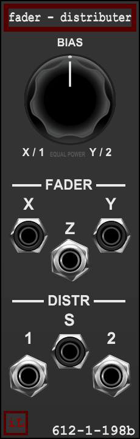

# 6121198b Fader / Distributer B — Equal Power — User Manual

**Version 2.0.0 · Voltage Modular · Wardenclyffe Station**



# 6121198b Fader / Distributer B — Equal Power — User Manual

**Version 2.0.0 · Voltage Modular · Wardenclyffe Station**


This instrument performs two manual signal operations at once. The **FADER** crossfades X and Y to Z. The **DISTR** balances S between outputs 1 and 2. One large BIAS control moves both sections together; it is not a CV input and it does not link the audio paths.

## Signal flow

```text
X ─┐
   ├── FADER (equal-power) ── Z
Y ─┘

S ─── DISTR (equal-power) ── 1 / 2
```

| Panel connection | Function |
| --- | --- |
| **X** | First FADER input; unpatched input contributes 0 V. |
| **Y** | Second FADER input; unpatched input contributes 0 V. |
| **Z** | Weighted X/Y sum. |
| **S** | DISTR signal input; unpatched input contributes 0 V. |
| **1, 2** | Complementary weighted distribution outputs. |
| **BIAS** | Shared manual control for both sections. The X/1 end favors X and output 1; the Y/2 end favors Y and output 2. |

## Law and character

This is the fixed **equal-power** model. At center, each side has a weight of approximately 0.707 each (−3.01 dB per path). Endpoints are level-conscious. With equal-power operation, correlated signals may sum louder at the center; that follows the chosen law.

The voice belongs to the same family as its companion: a related, more open later-model voice. The character is part of the low-cost relay-style signal path and is most apparent when the input level drives it. The module remains a mono utility; the two sections are independent functions, not stereo channels.

## Patch examples

**Crossfade:** Patch two sources to X and Y, then monitor Z while moving BIAS.

**Distribute:** Patch one source to S. Outputs 1 and 2 move in opposite directions as BIAS moves.

**Use both sections:** Crossfade X/Y at Z while distributing a separate signal from S to outputs 1 and 2.

## Bypass and limits

Host BYPASS copies X to Z and S to both distribution outputs. It skips tone processing and control movement. This is a hard bypass and can click when switched, consistent with the shared Voltage Modular infrastructure.

There are no CV inputs, independent section controls, stereo mode, trim stage, law switch, or hidden normal between the two sections. A and B are separate fixed-law instruments.
