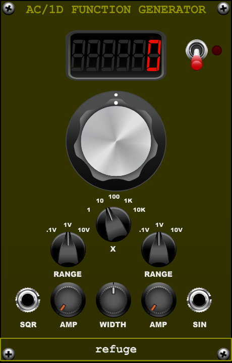

# Function User Manual

**Insect Laboratories · Voltage Modular · canonical release 1.0.0**

Manual draft prepared 4 October 2026.

Function is a deliberately worn, hand-built laboratory oscillator inspired by the Heathkit AG-10 family. It contains two separate oscillator boards: a sine source and a square source. They share manual tuning controls, but their phases are independent and they are not phase-locked.

This guide describes [release 1.0.0](). Open `function.vmod` in Voltage Module Designer to build the module.

## Controls and outputs

| Control or jack | Function |
| --- | --- |
| FREQUENCY | Tunes the base oscillator setting. The display shows the resulting output frequency after multiplication. |
| MULTIPLIER | Selects ×1, ×10, ×100, ×1K or ×10K. The default is ×10. |
| SINE RANGE / AMPLITUDE | Selects the sine output ceiling of 0.1 V, 1 V or 10 V peak; AMPLITUDE moves from silence to that ceiling. |
| SINE OUT | Outputs the sine oscillator. Its harmonics are slightly imperfect by design. |
| SQUARE RANGE / AMPLITUDE | Independently selects the square output ceiling of 0.1 V, 1 V or 10 V peak; AMPLITUDE moves from silence to that ceiling. |
| SQUARE WIDTH | Sets the pulse width from 5% to 95%. |
| SQUARE OUT | Outputs the square oscillator. |
| POWER | Fades the oscillators over approximately 8 ms when switched on or off. |

The two amplitude controls and ranges are independent. High output settings add restrained compression. Each board also has its own slow drift, so the displayed setting is a useful tuning reference rather than a promise of phase or frequency identity between the two outputs.

## Frequency ranges and display

The multiplier/frequency control covers these ranges:

| Multiplier position | Actual output range |
| --- | ---: |
| ×1 | 0.1–100 Hz |
| ×10 | 1–1,000 Hz |
| ×100 | 10–10,000 Hz |
| ×1K | 100–23,760 Hz |
| ×10K | 1,000–23,760 Hz |

At startup the multiplier is ×10 and the oscillator is tuned to C4, approximately 261.63 Hz. The display reports actual frequency after the multiplier, not the pre-multiplied base setting. On the upper ranges, the available frequency is spread over the full knob travel and stops below the 48 kHz Nyquist limit.

## Example patches

**Compare two waveforms.** Set both range switches to the same level, patch SINE OUT and SQUARE OUT to separate inputs, and use the common frequency controls. Listen for the distinct harmonic content; do not expect their phases to line up.

**Set a reference and a hot signal.** Use one channel at 1 V peak and the other at 10 V peak. The independent AMPLITUDE controls let you compare both sources without changing the tuning.

**Use pulse width as a tone control.** Start near 50%, then move SQUARE WIDTH toward either end for narrower pulses. The useful range stops at 5% and 95% rather than reaching an absent pulse.

## POWER and host bypass

The panel POWER switch fades on/off over 8 ms and stops the oscillators after fade-out. Host bypass is different: it silently bypasses the source and freezes state. It is a direct low-CPU behavior rather than a crossfade.

For source-pair checks and final release evidence, see the [Function 1.0.0 release record](README.md).
