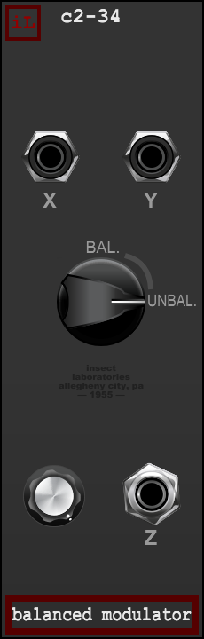

# c2-34 Balanced Modulator User Manual

**Insect Laboratories · Voltage Modular · canonical release 1.0.0**

The c2-34 is a mono amplitude/ring modulator inspired by primitive postwar test equipment. It keeps the circuit simple: two input signals, one continuous BAL / UNBAL control, one output-level control, and no internal oscillator.



Open `c234.vmod` in Voltage Module Designer to build the module. The matching exported source is `c234.java`.

## Signal path

```text
X (signal/carrier) ──┐
                     ├── BAL / UNBAL mode ── Amplitude ── Z
Y (modulator/control)┘
```

| Control or jack | Range / default | Operation |
| --- | --- | --- |
| X | Audio input; unpatched = 0 V | Signal or carrier input. It is the direct signal passed to Z during host bypass. |
| Y | Voltage/audio input; unpatched = 0 V | Modulator input. Its DC component is preserved. A nominal +5 V gives unity at either mode endpoint. |
| BAL / UNBAL | Continuous; default UNBAL | Sweeps between a unipolar VCA at the UNBAL end and carrier-suppressed four-quadrant modulation at the BAL end. |
| Amplitude | Linear 0–1; default 1 | Final output level after modulation and feedthrough. Manual movement is smoothed over 5 ms. |
| Z | Audio output | Carries the result of the selected operating region and Amplitude control. |

## Operating regions

At the **UNBAL** endpoint, Y controls X as a unipolar VCA: 0 V or negative voltage closes the VCA, and +5 V reaches unity. Between the endpoints, the response moves smoothly toward balanced multiplication.

At the **BAL** endpoint, the module multiplies X by Y relative to a 5 V reference. A zero-volt Y input suppresses the carrier; positive and negative Y produce opposite output polarity. This is the balanced, four-quadrant region.

The middle of the knob travel is intentionally imperfect. A broad dirty zone lets a small portion of X or Y feed through, suggesting the finite isolation of a hand-built circuit. Each feedthrough component reaches a maximum of 6% of its input. The two components can overlap near the middle, producing up to 12% combined feedthrough in the worst aligned case. The zone is a continuous part of the control travel, not a separate switch or mode.

The Amplitude control is after both modulation and feedthrough, so it scales the entire output. The DSP does not add a transformer model, saturation stage, or intentional filtering.

## Patch ideas

**Classic ring modulation:** Patch an oscillator to X and a second oscillator to Y. Move BAL / UNBAL to BAL and set Amplitude for the desired level. Tune the oscillators independently to explore sidebands and inharmonic tones.

**Envelope-controlled VCA:** Patch audio to X and a positive envelope to Y. Move BAL / UNBAL to UNBAL. Use Amplitude as the final level trim.

**Find the dirty zone:** Feed related or unrelated signals to X and Y, then sweep the mode control through its center. The extra feedthrough can reveal the source signals beneath the modulation. The modest level is intentional; reduce Amplitude if both inputs align and raise the combined output.

**Use DC deliberately:** A static voltage on Y shifts the modulation behavior. BAL retains bipolar control and does not block DC; use SIGPROC or another offset tool if the offset becomes undesirable.

## Bypass and technical behavior

Voltage Modular host BYPASS is a direct patch-through: X passes to Z exactly, while Y and the panel controls are ignored and DSP histories are frozen. Switching bypass can click because it changes routing abruptly, consistent with the Laboratory bypass standard.

The processor is mono and runs at native sample rate. It allocates no objects in the audio callback and uses basic multiplication, smoothing, and control-shaping arithmetic. No 2× or higher oversampling is used; this keeps CPU use low and leaves any high-frequency multiplication products subject to the host's sample-rate limits.

Release 1.0.0 is the first canonical release. Its BAL/UNBAL behavior and dirty-zone level were approved after listening tests. See [REVIEW.md](REVIEW.md) for source-pair, SDK, and DSP checks.
