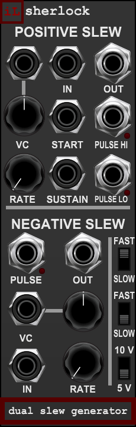

# Sherlock — User Manual

**Insect Laboratories · Laboratory collection · v1.0.0**

Sherlock combines independent positive and negative slew limiters with patchable pulse feedback. It processes DC control voltages and audio, and creates triggered or repeating contours.

## Signal paths

- Positive IN → Positive OUT limits rising voltage movement. Falling movement follows immediately.
- Negative IN → Negative OUT limits falling voltage movement. Rising movement follows immediately.
- Both paths preserve bipolar voltages and steady-state levels. An unpatched input is 0 V.
- **There is no normal or crossfeed between the sections.** Use a cable for either cascade order.
- A slew limit describes volts per second. A 10 V excursion takes twice as long as a 5 V excursion.
- Input signal levels are not scaled by the 5/10 V switch. No added saturation, curvature, drift or noise.

## RATE and VC

| Range | RATE counterclockwise | RATE clockwise |
| --- | ---: | ---: |
| FAST | 4 seconds per 5 V | 100 microseconds per 5 V |
| SLOW | 4,000 seconds per 5 V | 100 milliseconds per 5 V |

The knob taper is logarithmic; the voltage slopes are linear. At any matching RATE/VC setting,
SLOW takes exactly 1,000 times longer than FAST. The range switch changes the rate immediately
without resetting the signal voltage. Manual RATE and VC-amount movements receive 3 ms control
smoothing; incoming CV and signal edges are not smoothed before the slew calculation.

VC mapping: each attenuverter spans −1 to +1 with zero at noon. At +1 gain,
+1 V doubles slew rate and −1 V halves it, until the selected range's endpoints are reached.
Negative attenuation reverses that response. VC is processed at the audio sample rate; fixed
values use cached coefficients. CV does not extend the selected time range in this release.

Rate tooltips show **seconds per 5 V before VC**; typed edits use seconds. VC tooltips/typed
edits use signed gain. The native host engine runs at 48 kHz; there is no oversampling.

## Generated positive contour

START's rising edge starts a complete rise from 0 V to the selected peak, followed by a hard
reset to zero. Additional START edges while rising or held are ignored and not queued.
Holding START high does not repeat or hold the cycle.

SUSTAIN's rising edge also starts the full rise. A high SUSTAIN gate holds the peak;
releasing it resets the output. If SUSTAIN falls before the peak, the rise completes first.
SUSTAIN can also hold a rise initiated by START. START/SUSTAIN gate detection uses 1 V on,
0.5 V off hysteresis.

The positive signal input is overridden while a generated contour is active. After its
reset sample, ordinary signal following resumes. The peak is emitted for at least one
sample so that an externally patched Negative stage can see and shape the reset edge.

Voltage switch: **down = 5 V (default), up = 10 V**. It changes the positive generated
peak without changing slew rate. Switching from 5 V to 10 V during a sustained hold causes
a rate-limited climb to 10 V; switching down permits the unrestricted falling change.
The pulse gates remain 0/+5 V. Negative self-cycling consequently retains a 5 V excursion;
the negative section also accepts independently patched 10 V or bipolar signals.

## Pulse outputs and feedback

| Output | Behavior |
| --- | --- |
| Positive PULSE HI | +5 V while a generated rise/peak hold is active; otherwise 0 V |
| Positive PULSE LO | +5 V at/below the low-voltage threshold; otherwise 0 V |
| Negative PULSE | +5 V at/below the negative section's low-voltage threshold; otherwise 0 V |

Low detectors assert at/below 1 mV and release at/above 2 mV. They stay asserted for negative
voltages. They are level detectors, not universal end-of-slew detectors for arbitrary targets.
Positive PULSE LO is not the inverse of HI: during ordinary positive-voltage signal following,
both can be low. At idle with zero-valued inputs, LO and Negative PULSE are high.
Each indicator follows its own pulse gate, with writes only on transitions and no pulse stretching.

- Patch **Positive PULSE LO → START** to make rising ramps.
- Patch **Negative PULSE → Negative IN** to make falling ramps.
- Patch **Positive OUT → Negative IN** for rise/fall shaping, with both intermediate and final outputs available.

No hidden loop mode or patch-cable identification is used. All cycling emerges from the
actual pulse and signal paths. Loop frequency includes native sample/reset/cable timing,
so it is not exactly the reciprocal of the nominal 5 V traversal time at fast settings.

## Startup defaults

| Control | Default |
| --- | --- |
| Positive range | FAST, up; upper range switch |
| Positive RATE | 0.6571893032751831 normalized position, calibrated near C4 |
| Negative range | SLOW, down; lower range switch |
| Negative RATE | 0.9809983491460378 normalized position, calibrated near C−1 |
| Both VC attenuverters | 0, noon |
| Generated voltage | 5 V, down |

At 48 kHz with one-sample cable feedback, the actual core measured **262.2951 Hz** for the
positive default and **8.175779 Hz** for the negative default. Positive is about 4.4 cents
above C4; Negative is approximately C−1. A two-sample feedback delay produces 260.8696 Hz
and 8.172995 Hz respectively. These are rough pitch defaults, not tracking oscillator claims.
Negative RATE naturally starts near its clockwise endpoint because C−1 lies near the fast
end of SLOW. The numeric defaults, text defaults, constructor defaults, and saved Designer
test-control values are synchronized.

## Bypass and resumption

Host bypass copies each signal IN directly to its corresponding OUT, silences all three
pulse outputs/lamps, reads no controls, VC, START or SUSTAIN, and freezes processing histories.
There is no crossfade or normalization. On resumption, controls snap to their current values
and the slew/trigger states restart from zero. A gate already high at resumption starts a
fresh contour. No stale held contour is replayed.

## Patch examples

### Independent glide

Patch a sequencer or n01 STEPPED to Positive IN and take Positive OUT to a pitch or modulation
input. Upward changes glide; downward changes remain immediate. Patch a different source to
Negative IN for the opposite behavior. Both sections can operate at different rates and ranges.
At steady state, output voltage equals input voltage; octave-sized moves take longer than small moves.

### Rise and fall envelope

Patch Positive OUT to Negative IN and take Negative OUT to SIGPROC's external VCA control.
Send triggers to START for a full rising contour with a falling tail, or gates to SUSTAIN
for a rise, held peak and release. Positive RATE sets the rise and Negative RATE sets the fall.
The Negative section shapes the actual incoming voltage, so rapid repeats can interrupt a tail.

### Processing a gate directly

Patch a gate to Positive IN and then cascade to Negative IN. A short gate may end before the
positive output reaches the gate's full height. This produces a smaller contour. START instead
launches a full rise regardless of trigger duration. Compare these two patches for different accents.

### Repeating contours

Patch Positive PULSE LO to START for rising ramps, or Negative PULSE to Negative IN for falling
ramps. Use FAST for audio and ordinary modulation, SLOW for long movement. Cascading the positive
loop into Negative IN rounds its reset into a falling slope. Loop rate and resulting amplitude
interact when the second section cannot finish following before the next cycle.

### Audio waveform shaping

Patch Function SQR or another audio signal to a slew input. Reduce RATE until the limited edge
becomes audible. Slew limiting depends on both signal amplitude and frequency, so changing the
input gain changes the result. Cascading both sections limits both edge directions. One-sided
processing can create a DC offset; use external DC removal where the destination requires it.

### Long movement

In SLOW, patch a fixed voltage from SN-16u or SIGPROC to an input and use the output as gradual
modulation. With a 5 V change, the slowest traversal is 66 minutes 40 seconds; a 10 V change takes
133 minutes 20 seconds. In the unrestricted direction the voltage follows immediately.

## Troubleshooting and practical limits

- **The module is silent:** Sherlock needs an input, a START/SUSTAIN gate, or a feedback cable.
  It has no internal free-running loop switch.
- **The negative half does not follow the positive half:** connect Positive OUT to Negative IN.
  The sections are deliberately independent.
- **A pulse indicator stays lit:** low-level detectors remain high at zero and below; this is expected.
- **RATE seems stuck near an extreme:** applied VC may be pushing it against the selected range limit.
- **Changing to 10 V does not change the negative feedback pitch:** Negative PULSE remains +5 V;
  the voltage switch sets the positive generated peak only.
- **A short signal pulse gives a small contour:** ordinary slew follows the duration and level of that
  pulse. Use START for a complete generated rise.
- **Loop pitch is approximate:** native sample and cable/reset timing affect the cycle. Additional
  modules in the feedback path can change it further. Sherlock is not a precision tracking VCO.
- **Audio-rate output has harmonics:** hard resets and asymmetric slopes are intentional. Native-rate
  processing can alias at high rates; this version has no oversampling or band-limited oscillator layer.
- **After bypass, a contour restarts:** resumption clears old slew/trigger history and adopts current
  controls. Saving a patch restores panel settings, not the precise in-progress ramp position.

## Design references

The instrument draws on Ken Stone's adaptations of the classic Serge positive and negative slew
circuits, with the user's chosen ranges, independent routing and 5/10 V positive contour option.
It is a behavioral digital instrument rather than a component-level electrical simulation.

- [CGS Positive Slew](https://www.elby-designs.com/webtek/cgs/serge/cgs83/cgs83_positive_slew.html)
- [CGS Negative Slew](https://www.elby-designs.com/webtek/cgs/serge/cgs582/cgs582.htm)
- [Richard Brewster's positive slew build](https://pugix.com/cgs-serge-positive-slew-ssg-and-noise/)

See the [release review](REVIEW.md) for validation evidence and [release files](README.md) for the paired source.
