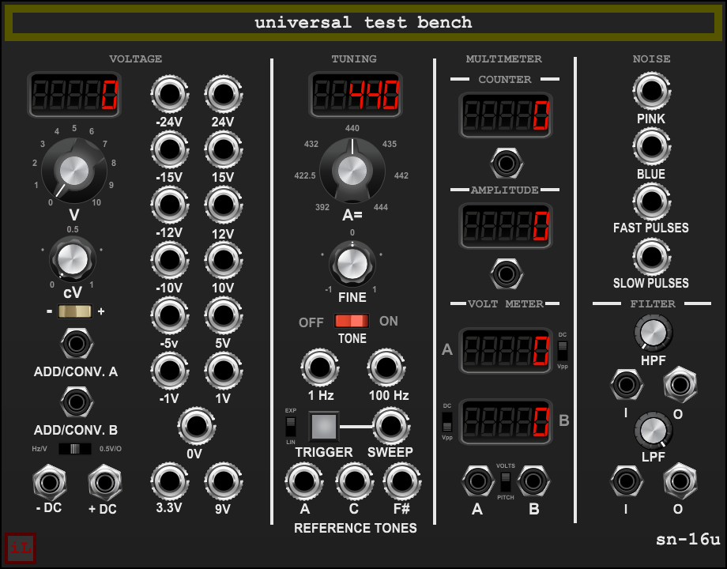

# sn-16u Universal Test Bench — User Manual

**Version 2.0.0 · Voltage Modular · Wardenclyffe Station**

sn-16u is a manual laboratory test instrument for checking and calibrating pitch voltage, reference frequencies, audio level, frequency, and simple filtering. Reference signals are clean and stable; the instrument does not add the vintage coloration used by other Laboratory modules.

## Quick start

- **Patch standards:** Center **STANDARDS** is 1 V/oct. Select left for Hz/V or right for 0.5 V/oct when reading/converting another convention.
- **Hear references:** A/C/F# jacks are adjustable tuning references. The 1 Hz, 100 Hz and 1 kHz jacks are independent fixed sine references. The three notes from the tuning section follow the TONE switch; the courtesy tones do not.
- **Read signals:** Patch to meter A or B, COUNTER, or AMPLITUDE. The A/B meter starts in VOLTS, with A on DC and B on Vpp. PITCH mode interprets pitch CV using STANDARDS.
- **Check fixed references:** Use an external meter to verify output voltage. Host and hardware voltage calibration affect actual patch levels.

## Controls and connections

### VOLTAGE: adjustable master and fixed outputs

**WHOLE VOLTS** sets 0–10 V in integer steps. **FRACTIONAL VOLTS** adds a continuous 0–1 V. **POLARITY** reverses only this combined manual setting. **ADD/CONV A** and **ADD/CONV B** are summed at unity with the signed manual voltage in the native 1 V/oct domain. The complete sum is then converted once under STANDARDS. **+DC** outputs the converted sum; **−DC** is its exact inverse. These inputs are pitch-voltage add/conversion inputs, not independently scaled channels.

| STANDARDS | Master conversion and meter interpretation |
|---|---|
| Left: Hz/V | C1=1 V, C2=2 V, C3=4 V, C4=8 V. The 1 V/oct master sum maps to Hz/V voltage as 2^(V−1). A direct Hz/V PITCH meter reading is 32.7032 Hz per input volt; zero or negative input reads 0 Hz. |
| Center: 1 V/oct (default) | Native convention: C0=0 V, one volt per octave. Pitch meter uses C0=16.3516 Hz and doubles frequency per volt. |
| Right: 0.5 V/oct | Half a volt per octave. Pitch meter uses C0=16.3516 Hz and doubles frequency per 0.5 V. |

The Hz/V master mapping preserves musical C0 at 0.5 V (about 16.35 Hz), while a direct 0 V Hz/V meter input reads 0 Hz. This is the low-frequency distinction between a musical note and the theoretical zero-frequency floor. STANDARDS never changes the dedicated fixed-voltage outputs or the physical frequencies of the sine references.

The master conversion is not clipped to ±24 V. Large WHOLE VOLTS settings or input CV can produce large voltages. Set controls cautiously before connecting +DC to sensitive equipment.

Dedicated, continuously available fixed sockets are **−24, +24, −15, +15, −12, +12, −10, +10, −5, +5, −1, +1, 0, +3.3, and +9 volts**. They are unaffected by STANDARDS. Host bypass silences them.

### TUNING and REFERENCE TONES

**A REFERENCE** has seven intentionally ordered detents. The default/upright setting is 440 Hz.

| Displayed setting | A output frequency at FINE center |
|---:|---:|
| 392 | 392 Hz |
| 422.5 | 422.5 Hz |
| 432 | 432 Hz |
| 440 | 440 Hz |
| 435 | 435 Hz |
| 442 | 442 Hz |
| 444 | 444 Hz |

The selector order follows the panel and is not sorted numerically. **FINE** is bipolar, ±100 cents (one semitone); its small center detent helps return to zero without skipping values. **A**, **C** and **F#** outputs are clean ±5 V peak sine references and follow A REFERENCE and FINE. C4 sits nine semitones below A4; F#4 sits three semitones below A4. **TONE** switches these three references together with a short 5 ms smoothing fade.

**1 Hz**, **100 Hz** and **1 kHz** each output a clean fixed ±5 V peak sine. These courtesy outputs ignore TONE, A REFERENCE and FINE. Host bypass silences them and freezes their phases. The TONE switch initializes ON in the current design.

### TRIGGER / SWEEP

Press **TRIGGER** to start a one-shot sine sweep at **SWEEP**. It runs from 0.01 Hz to 23,760 Hz over 42 seconds at the 48 kHz processing rate, then resets silently and waits. It does not loop. Pressing the trigger during a sweep restarts from the beginning. **LIN** is down; **EXP** is up. The curve is read when the sweep starts. Output level is ±5 V peak with a 5 ms fade at each endpoint. A mid-sweep restart may make a small discontinuity.

The button lights while the sweep is running and clears on completion or bypass; it is a momentary trigger, not a latched control. Its brightness is not proportional to frequency. The upper endpoint is just below Nyquist at 48 kHz.

### NOISE and PULSES

**PINK** outputs broadband pink noise. **BLUE** outputs blue-like noise made by differentiating the same pink process, so they are related, not independent sources. Typical measured capture levels were about 0.87 V RMS pink and 1.15 V RMS blue; instantaneous level varies. Blue rises approximately 3 dB per octave through much of its useful midband and bends near Nyquist. Neither output is a calibrated noise standard or hard-clipped signal. The pinking algorithm follows Paul Kellett's refined pink-noise filter approximation.

**FAST PULSES** emits one +5 V sample every 512 samples (93.75 Hz at 48 kHz). **SLOW PULSES** emits one +5 V sample every 4096 samples (11.71875 Hz at 48 kHz). All other samples are 0 V. They are narrow timing impulses, not square waves.

### MULTIMETER: A and B

Patch **A** and/or **B** inputs. Each channel has its own **DC/Vpp** selector:

- **DC:** signed average voltage, so negative offsets remain negative.
- **Vpp:** maximum minus minimum voltage over the measurement window.

**VOLTS/PITCH** selects the shared mode. VOLTS is default and uses each channel's DC/Vpp selector; PITCH overrides both and displays frequency decoded from the input pitch voltage according to STANDARDS. Returning to VOLTS restores each channel's setting. PITCH readings are calibrated to A440 equal temperament independently of the adjustable tuning output. An unpatched input reads zero.

The meter observes a rolling window of up to approximately one second and updates every 50 ms. Allow the window to settle after patching or changing the signal. The meter is useful for bench comparisons; no certified calibration accuracy is claimed.

### COUNTER and AMPLITUDE

**COUNTER** measures the period of a recurring audio waveform from interpolated rising crossings near +1 mV, rearmed at or below zero. Slow waveforms take longer to acquire. It works best with a clean, single periodic waveform centered near zero. Polyphonic signals, noisy or irregular crossings, and large DC offsets can produce unstable or absent readings. The stale reading clears after crossings stop.

**AMPLITUDE** displays true RMS, including DC, over a rolling window of up to about one second, updating every 50 ms. Use the A/B DC meters to distinguish steady offset from changing signal. An unpatched input reads zero.

### FILTER

The upper **HPF I/O** and lower **LPF I/O** are separate, independent paths. Each is a clean one-pole filter without resonance. Their knobs set a logarithmic cutoff from 1 Hz to 20 kHz and smooth over about 5 ms. At cutoff, response is approximately −3 dB. Defaults are HPF at 1 Hz and LPF at 20 kHz, which are close to transparent over most of the audio band. There is no normalled connection between the two filters.

## Bypass, reset and saved settings

Host bypass silences every generated source, including fixed voltages, references, noise, pulses and sweep. Each filter passes its own input directly to its matching output. The bypassed master outputs carry raw ADD A + ADD B at unity and its inverse; manual voltage and pitch conversion are skipped. DSP histories freeze while bypassed. On resume, meter windows refresh and filter state starts from the current input. A running sweep resumes at its frozen point; triggers pressed while bypassed are discarded. Host reset, preset load or variation load stops the sweep and resets measurement history.

Initial panel setup: WHOLE and FRACTIONAL at zero, positive manual polarity, 440 Hz A REFERENCE, centered FINE, center/1 V-octave STANDARDS, VOLTS meter mode, meter A on DC, meter B on Vpp, HPF minimum cutoff, LPF maximum cutoff, TONE on, and sweep idle. Voltage Modular saves panel control changes with the patch.

## Suggested bench procedure

1. Use an external voltmeter to check several fixed outputs and verify they remain fixed when STANDARDS changes.
2. Select 1 V/oct, set WHOLE/FRACTIONAL to known values, and check +DC and its exact inverse. Patch ADD A/B one at a time, then test conversion.
3. Confirm Hz/V C1/C2/C3/C4 correspondence at 1/2/4/8 V. With PITCH selected, check direct 0 V Hz/V reads zero.
4. Compare A/C/F# against a tuner. Change A REFERENCE and FINE, then return FINE to center. Turn TONE off and confirm the three courtesy tones continue.
5. Run both sweep curves, observe the button indicator, restart mid-sweep and confirm silent completion after 42 seconds.
6. Compare the noise colors with an analyzer. Patch a periodic signal to COUNTER and meter A/B, then test DC, Vpp, PITCH and RMS.
7. Test HPF and LPF independently with a tone below and above their cutoff. Engage bypass and confirm each filter's dry path and the master bypass behavior.

## Limits

This manual describes a software test instrument. Actual signal voltage depends on host calibration and the audio path; check it before connecting physical equipment. The meters, noise sources and simple filters are useful references but are not certified measurement standards. The counter expects periodic zero-crossing audio. Frequencies and timing are designed around 48 kHz. Signal power, decimal display rounding and visual button appearance depend on Voltage Modular and its control skins.
