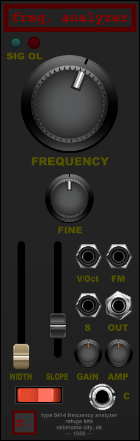

# Type 9414 Frequency Analyzer — User Manual

**Version 2.0.0 · Voltage Modular · Wardenclyffe Station**

Type 9414 Frequency Analyzer is a mono selective amplifier. MAIN isolates a tunable band of frequencies;
C rejects the same band. Input gain feeds both filters, while AMP sets only MAIN's output level.
The clean filter core and gently limited output stages suit isolating partials, finding resonances,
removing a narrow tone, or extracting ringing textures from complex sound.

## First patch

The module loads **OFF**, with frequency at 1 kHz, bandwidth at 2 Hz, slope at 4, and GAIN/AMP at 0 dB.
Connect a source to S and MAIN to your monitoring path, then turn POWER on. Sweep FREQUENCY to find
a partial. A 2 Hz band is very narrow: sound outside it is strongly attenuated, and the filter takes
time to settle after a large tuning change. Increase WIDTH to hear a broader portion of the source.

To test C, start with a steady 1 kHz sine. At the default tuning, MAIN passes that tone and C nulls
it after the filters settle. Loop TestBench's `selectivity_1k_neighbours_8s.wav` to compare the center
tone with neighbours 1 Hz and 10 Hz away. The filter edges have finite slopes, so their transition
regions appear at both outputs; the center notch is complete.

## Controls

| Control | Range and use |
|---|---|
| FREQUENCY | Logarithmic 20 Hz–18 kHz center. Default 1 kHz. |
| FINE | Adds or subtracts up to 2 Hz after pitch transposition. Center is zero. |
| WIDTH | Logarithmic 2–100 Hz full bandwidth, measured between the −3 dB edges. |
| SLOPE | 1–12 Butterworth poles per skirt. Higher settings reject nearby frequencies more steeply and can ring longer. Default 4. |
| GAIN | −24 to +24 dB before both active filters; 0 dB at noon. |
| AMP | −24 to +36 dB after MAIN's bandpass; 0 dB at noon. Does not change C. |
| POWER | Smooth 10 ms transition between active filtering and the powered-off paths. |

The two gain knobs together provide −48 to +60 dB before MAIN's ceiling. Their minimum positions
attenuate rather than fully mute; use POWER to silence MAIN. Numeric tooltip entry uses Hz or dB.
Manual controls are smoothed. SLOPE selects discrete settings with a short crossfade between filters.

## Connections

**S** is the mono audio input. With POWER on, GAIN acts before both filters and stays clean.

**MAIN / OUT** carries the selected band through AMP. The output is clean through ±20 V and then
softly compresses toward a ±24 V ceiling. A higher gain setting can therefore increase compression
once the ceiling is reached, rather than continuing to increase peak level.

**C** is the matching band-reject output. It skips AMP, remains clean through ±16 V, and softly
approaches ±20 V. With POWER off, C passes raw S through that ceiling, bypassing GAIN and the filter.

**V/Oct** transposes the FREQUENCY setting at one volt per octave. **FM** adds linear modulation at
100 Hz per volt. Both work at audio rate and may be patched simultaneously. FINE is an absolute Hz
offset. The final center is:

`FREQUENCY × 2^(V/Oct) + FINE + 100 × FM`, limited to 20 Hz–18 kHz.

Rapid modulation of a narrow filter changes its stored ringing as well as its response. Strong
modulation can drive that ringing into the output ceilings; this is different from a simple volume gate.

## Indicators

SIG shows MAIN's post-AMP output level. OL responds when MAIN's soft ceiling begins to work, holding
under sustained limiting. Neither indicator monitors C. Both go dark when fully powered off or bypassed.

## Power and host bypass

| State | MAIN | C |
|---|---|---|
| POWER on | Bandpass → AMP → ceiling | Matched band-reject → ceiling |
| POWER off | Silent | Raw S → ceiling |
| Host BYPASS | Exact raw S | Exact raw S |

Host bypass makes the module a unity splitter, regardless of its controls. It skips all gain, filtering,
ceilings and fades and freezes DSP histories. Releasing bypass adopts the current controls immediately;
it is deliberately abrupt. A panel power change instead takes 10 ms.

## Technical behavior

The bandpass and notch share center, bandwidth and slope, with separate signal histories. Their
settled squared magnitudes are complementary before gain and limiting, but they are not a phase-neutral
dry reconstruction when summed. A band transformation uses twice the selected skirt order in total:
the default setting has four-pole rolloff on each side and eight poles in the complete filter.

The core uses Voltage Modular's 48 kHz engine rate. Output ceilings retain the tested native-rate
soft transfer curve; no additional oversampling, hum, drift or noise has been added in this candidate.

## Power and output ceilings

The module loads powered off. POWER fades MAIN toward silence and C toward its raw-signal ceiling; this is separate from the abrupt host BYPASS, which sends raw S to both outputs without either ceiling. MAIN has its own AMP stage and ±24 V soft ceiling. C is the matched band-reject output, bypasses AMP, and has a ±20 V ceiling.
