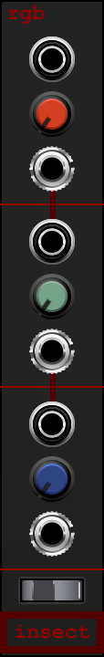
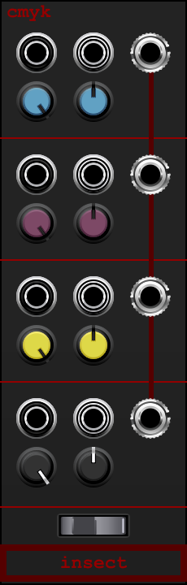
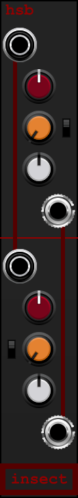

# Colorbox Collection User Manual

**Insect Laboratories · Voltage Modular · current canonical releases**

Manual draft prepared 4 October 2026

Colorbox is a family of three mono processing modules built from distinct saturation and folding stages. Each stage can operate on its own or feed the next stage through the module’s normalled routing. That makes it easy to build a longer chain, use one stage as a standalone processor, or patch several stages as parallel paths. Stereo and dual-mono use comes from patching independent stages or using duplicate modules; the processors themselves do not link stereo channels.

| Module | Canonical version | Main character | Full module manual |
| --- | ---: | --- | --- |
| [RGB](../../colorbox/rgb/versions/4.0.3/) | 4.0.3 | Three different saturation stages | [RGB manual](../../colorbox/rgb/USER-MANUAL.md) |
| [CMYK](../../colorbox/cmyk/versions/1.0.3/) | 1.0.3 | Four CV-controllable wavefolding stages | [CMYK manual](../../colorbox/cmyk/USER-MANUAL.md) |
| [HSB](../../colorbox/hsb/versions/1.0.2/) | 1.0.2 | Two hue, saturation and brilliance processors | [HSB manual](../../colorbox/hsb/USER-MANUAL.md) |

These links point to the canonical Voltage Module Designer projects, source exports and panel images.

The linked module manuals document controls, defaults, normalled connections, operating examples, and bypass behavior for each release. Open a `.vmod` file in Voltage Module Designer to build or install the module; the archives are not prebuilt plug-ins.

## Basic patching

Patch an audio signal to the first stage input and take the processed signal from that stage’s output. When the next stage’s input is empty, it receives the previous stage’s output automatically. Patching a cable into that input breaks the normalled connection and lets you feed it a different signal.

For example, RGB can run RED → GREEN → BLUE with only a signal patched to RED IN and the final signal taken from BLUE OUT. To use GREEN by itself, patch a source directly to GREEN IN. Its output remains available at GREEN OUT, and the cable breaks the normal feed from RED.

## RGB · three-stage saturation · v4.0.3

RGB passes a signal through three stages with different saturation responses. Each stage has its own input, output and DRIVE control, so the whole chain or any individual stage can be used.

| Stage | DRIVE behavior | Normalled connection |
| --- | --- | --- |
| RED | Range 1–10; firmer, more aggressive soft saturation | Input is silent when unpatched; output feeds GREEN IN |
| GREEN | Range 1–10; rounded, gradual saturation | Unpatched input receives RED OUT; output feeds BLUE IN |
| BLUE | Range 1–10; increasingly asymmetric saturation and gritty edge | Unpatched input receives GREEN OUT |

The **DC FILTER** switch enables DC blocking after every saturation stage. With it on, stage offset is removed before it reaches the next stage or output. With it off, offset remains in the signal and can change how later saturation stages respond.

**Try:** Use RED for a firmer edge, GREEN for a rounder thickening, and BLUE when you want the most uneven, gritty harmonics. Increase DRIVE in stages to hear how the cascade builds; patch around a stage to compare it directly.

## CMYK · four-stage wavefolder · v1.0.3

CMYK runs CYAN → MAGENTA → YELLOW → BLACK. The folder shapes alternate through the chain, moving between rounded harmonics and brighter, more angular folds. Each stage has an audio input and output, an **INPUT LEVEL**, a **FOLD CV** input and a bipolar **FOLD CV** depth control.

| Control or jack | Use |
| --- | --- |
| INPUT LEVEL | Sets the signal level entering that folder. Center mutes; the left side reverses polarity; the right side passes normal polarity. |
| FOLD CV depth | Sets how much the patch at FOLD CV affects folding. Center applies no external CV; either side sets polarity and depth. |
| FOLD CV input | External voltage control for folding depth. When unpatched it is normalled to +5 V. |
| Audio input/output | Each stage can be fed or tapped independently. An unpatched input receives the previous stage’s output, except CYAN IN, which is silent when unpatched. |

The **DC FILTER** switch enables DC blocking after each folder. Turning it off lets DC from one stage influence the next stage’s folding.

**Try:** Patch a slow envelope to one stage’s FOLD CV input and set its depth away from center. Because the CV input is normalled to +5 V, return the depth to center when you want no contribution from that stage’s CV path.

## HSB · two-stage tone and fuzz processor · v1.0.2

HSB contains two independent processors. Each follows **HUE → SATURATION → BRILLIANCE**. Use each set of controls to shape its own path; the stages can be used separately or together.

| Control | Use |
| --- | --- |
| HUE | Tilts the tone before distortion, from bass-heavy warmth toward brighter emphasis. |
| SATURATION | Adds drive, compression and fuzz. Increase it for denser, more input-sensitive distortion. |
| BRILLIANCE | Shapes the result from softened highs, through a neutral center, toward stronger presence and air. |
| STANDARD / CUSTOM | Selects the character of that processor. Up is STANDARD; down is CUSTOM. Both switches initialize to STANDARD. |

**STANDARD** gives a thick, sustaining dual-feedback fuzz character without a conventional tone stack. **CUSTOM** gives a more aggressive, input-sensitive scramble fuzz. HUE and BRILLIANCE remain available in both settings.

The lower processor’s input receives the upper input when its own input is unpatched. When the upper output is unpatched, the lower output combines both processors. Patching the lower input or upper output lets you separate the paths.

**Try:** Set the two processors to different STANDARD/CUSTOM positions and balance them through the normalled lower output. Patch each output separately when you want to use the two voices as independent mono or dual-mono paths.

## Bypass and signal levels

Host bypass is designed to use little CPU: it stops the processing and preserves the modules’ normalled routing. Bypass switches abruptly, so the signal can pop or click at the moment it changes. Use a downstream mute for quiet switching when needed.

These modules are creative processors, not calibrated level standards. Their saturation and folding respond to the level presented at each stage. For repeatable results, keep the source level steady while comparing controls, and use the module’s outputs to listen to intermediate stages.

## Release notes and validation

The [Colorbox release notes](../../colorbox/CHANGELOG.md), [code conventions](../../colorbox/STANDARDS.md), and [validation report](../../colorbox/VALIDATION.md) document the archived source and checks. This manual describes the current versions listed above; use a module’s versioned archive when matching behavior to a particular project file.
