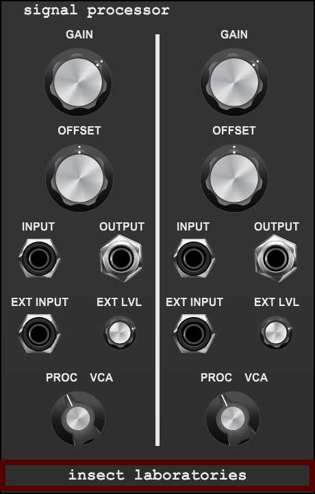
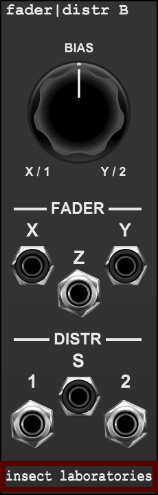
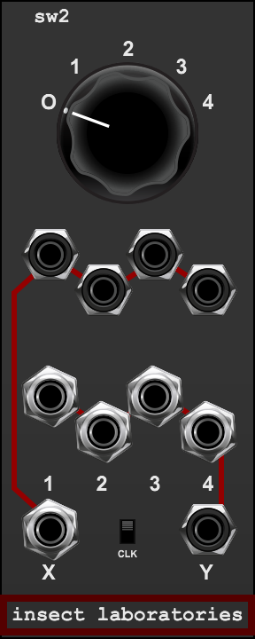
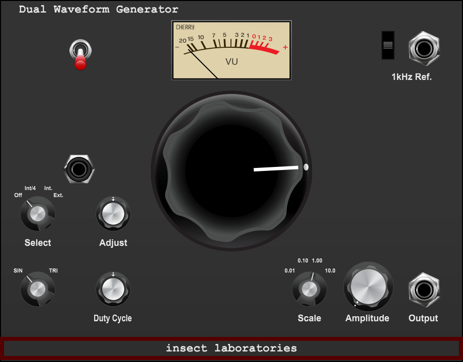
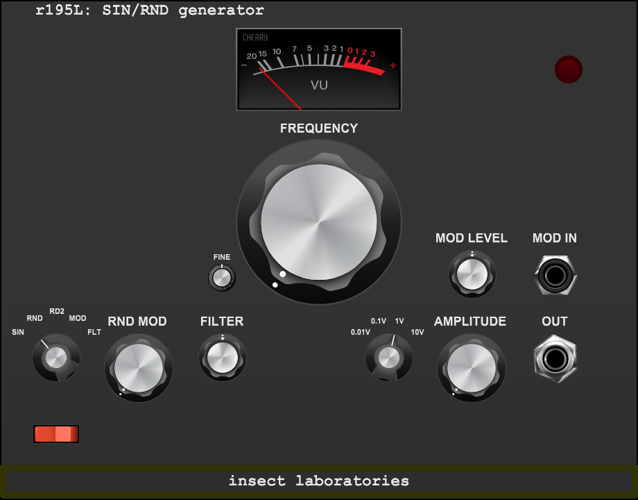
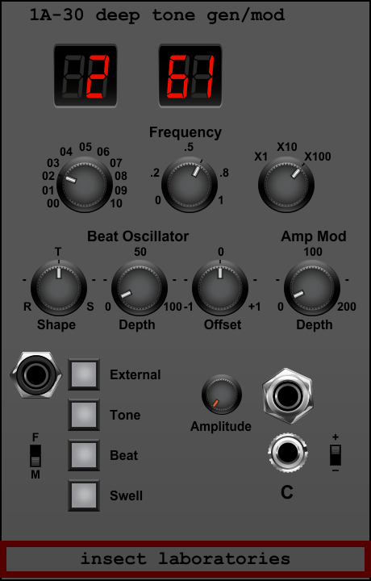
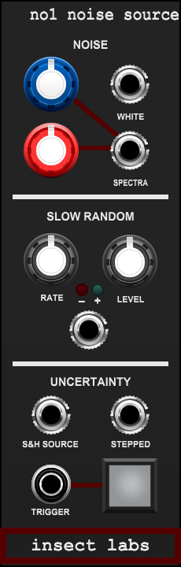
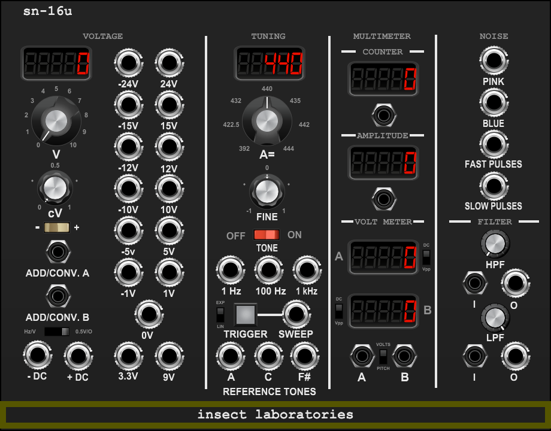
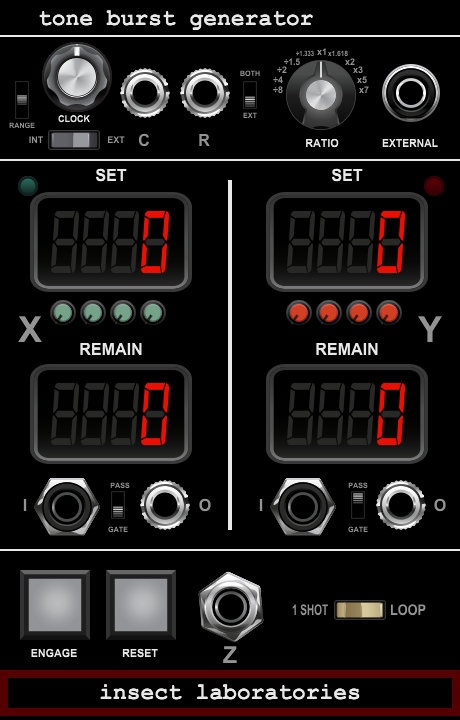

# Laboratory Collection User Manual

**Insect Laboratories · Voltage Modular · Series One**

Collection manual updated 4 October 2026

Laboratory is a mono-first collection of early test-equipment-inspired sources, processors, routers and measurement tools. Most controls are manual. The instruments share a restrained hardware character, while each keeps a distinct purpose and voice. Audio and control-voltage levels are part of the sound; check the output level before sending a hot source into another processor.

This manual covers the twelve canonical releases. The release links identify the exact version described and contain its Voltage Module Designer project, matching source export, artwork and review record.

| Module | Canonical version | Main use | Full manual |
| --- | ---: | --- | --- |
| [Signal Processor](../../laboratory/signal-processor/versions/1.0.1/) | 1.0.1 | Two independent gain, offset and VCA stages | [Manual](../../laboratory/signal-processor/USER-MANUAL.md) |
| [Fader\|Distr A](../../laboratory/faderdistr/versions/1.0.0/) | 1.0.0 | Linear crossfade and signal distribution | [Manual](../../laboratory/faderdistr/USER-MANUAL-A.md) |
| [Fader\|Distr B](../../laboratory/faderdistr/versions/1.0.0/) | 1.0.0 | Equal-power crossfade and signal distribution | [Manual](../../laboratory/faderdistr/USER-MANUAL-B.md) |
| [sw1](../../laboratory/sw1/versions/1.0.0/) | 1.0.0 | Manual 2×2 relay router | [Manual](../../laboratory/sw1/USER-MANUAL.md) |
| [sw2](../../laboratory/sw2/versions/1.0.0/) | 1.0.0 | Four-way manual selector and distributor | [Manual](../../laboratory/sw2/USER-MANUAL.md) |
| [Generator](../../laboratory/generator/versions/1.0.2/) | 1.0.2 | Sine and variable triangle test oscillator | [Manual](../../laboratory/generator/USER-MANUAL.md) |
| [Function](../../laboratory/function/versions/1.0.0/) | 1.0.0 | Independent sine and square test oscillators | [Manual](../../laboratory/function/USER-MANUAL.md) |
| [r195L: SIN/RND](../../laboratory/sinrnd/versions/1.1.0/) | 1.1.0 | Sine, noise, random FM and filtered audio | [Manual](../../laboratory/sinrnd/USER-MANUAL.md) |
| [Deep Tone Generator](../../laboratory/deeptone/versions/1.0.0/) | 1.0.0 | Deeply tunable sine, beat, FM and amplitude movement | [Manual](../../laboratory/deeptone/USER-MANUAL.md) |
| [n01 Noise Source](../../laboratory/n01/versions/1.0.0/) | 1.0.0 | Noise, continuous random voltage and sample/hold | [Manual](../../laboratory/n01/USER-MANUAL.md) |
| [SN-16u Test Bench](../../laboratory/sn-16u/versions/1.0.0/) | 1.0.0 | Pitch standards, references, meters, sweep and filters | [Approved manual](../../laboratory/sn-16u/versions/1.0.0/USER-MANUAL.md) |
| [Burstgen Tone Burst Generator](../../laboratory/burstgen/versions/1.0.0/) | 1.0.0 | Two counted signal gates, clock ratios and independent C/R Courtesy | [Manual](../../laboratory/burstgen/USER-MANUAL.md) |
| [Burstgen Tone Burst Generator](../../laboratory/burstgen/versions/1.0.0/) | 1.0.0 | Two counted signal gates, clock ratios and independent C/R Courtesy | [Manual](../../laboratory/burstgen/USER-MANUAL.md) |
| [Burstgen Tone Burst Generator](../../laboratory/burstgen/versions/1.0.0/) | 1.0.0 | Two counted signal gates, clock ratios and independent C/R Courtesy | [Manual](../../laboratory/burstgen/USER-MANUAL.md) |
| [Burstgen Tone Burst Generator](../../laboratory/burstgen/versions/1.0.0/) | 1.0.0 | Two counted signal gates, clock ratios and independent C/R Courtesy | [Manual](../../laboratory/burstgen/USER-MANUAL.md) |
| [Burstgen Tone Burst Generator](../../laboratory/burstgen/versions/1.0.0/) | 1.0.0 | Two counted signal gates, clock ratios and independent C/R Courtesy | [Manual](../../laboratory/burstgen/USER-MANUAL.md) |

## Signal Processor · two independent mono stages · v1.0.1

Each side has its own **INPUT**, **OUTPUT**, **GAIN**, **OFFSET**, **EXT INPUT**, **EXT LVL** and **PROC/VCA** selector. The two sides do not link controls or audio; use them as separate processors or as a dual-mono pair.

**GAIN** ranges from −3× to +3×. In **PROC**, gain is bipolar and external modulation responds immediately. Positive gain gives the fuller, driven character; negative gain gives a cleaner inverted path. In **VCA**, gain is unipolar and rounded, with the approved vactrol-style response: about 3 ms attack and 30 ms release. **EXT INPUT** controls gain; +5 V corresponds to the setting on **EXT LVL**. **OFFSET** adds a static voltage after the character stage and has no CV input.

**Try:** Put the left side in PROC for level shaping, then use the right side in VCA for slow gain movement. Patch an envelope to the right EXT INPUT and set EXT LVL to taste. The VCA mode is deliberately slower than an immediate linear multiplier.

Host bypass passes each input directly to its matching output.

## Fader|Distr A and B · crossfade and distribute · v1.0.0

Both models perform two separate functions at once. The **FADER** blends input **X** and input **Y** at output **Z**. The **DISTR** takes **S** and moves it between outputs **1** and **2**. The large **BIAS** control operates both functions in parallel. There are no CV inputs or pan-law switches.

| Model | FADER law | DISTR law | Character |
| --- | --- | --- | --- |
| A | Linear; each side is 0.5 at center | Linear distribution | Heavier, woollier relay voice |
| B | Equal power; each side is about 0.707 at center | Equal-power distribution | Related family sound with a more open tone |

The chosen endpoints are level-conscious. At the center of B, correlated signals can sum louder than either source alone; that is a normal result of the equal-power law.

**Try:** Crossfade two sources with X and Y and listen at Z. At the same time, patch a third source to S and use outputs 1 and 2 as opposite sides of its distribution. A and B have the same surface layout, so the fixed law and voicing distinguish them.

Host bypass routes X to Z and S to both distribution outputs.

## sw1 · manual 2×2 relay router · v1.0.0

In normal routing, **IN 1 → OUT 1** and **IN 2 → OUT 2**. Pressing the illuminated relay button selects the alternate position, which swaps the paths: **IN 1 → OUT 2** and **IN 2 → OUT 1**.

The **T/G** selector sets how the button works. **TOGGLE** changes routing with each press. **GATE** holds the alternate routing while the button is down and returns to normal when released. The lights show the selected output state. With neither input patched, the two outputs provide complementary +5 V manual toggle/gate signals.

**CLK** up selects direct routing. Down enables the approved click filter, which reduces switching clicks and darkens the edge slightly. This filter is part of the instrument’s sound; it is not a clean, transparent crossfade.

**Try:** Patch one source to IN 1 and use TOGGLE to choose which output receives it. Patch sources to both inputs when you want to swap destinations. With no signal inputs, use the complementary outputs as a manual gate pair.

Host bypass uses the normal route, passing IN 1 to OUT 1 and IN 2 to OUT 2.

## sw2 · four-way rotary selector/distributor · v1.0.0

The shared five-position **ROUTE** control selects **0/OFF**, **1**, **2**, **3** or **4**. The upper bank routes the selected **SOURCE 1–4** to **X**. At the same time, the lower bank routes common input **Y** to the matching **DESTINATION 1–4**. The two banks share a position but have no hidden connection to each other. Position 0 turns both banks off and is the startup/reset position.

**CLK** up gives immediate routing. Down adds a short relay-settling transition and a 2.2 kHz contact filter. The line-amplifier character remains present in both positions; the filtered setting has a more obvious vintage edge.

**Try:** Use SOURCE 1–4 and X to select one of four signals. At the same time, use Y and DESTINATION 1–4 to send one signal to a selected destination. The selection is manual; there is no CV input.

Host bypass preserves the selected dry route while skipping the filter and character processing.

## Generator · sine/variable-triangle source · v1.0.2

**WAVEFORM** selects sine or the triangle family. In triangle mode, **DUTY CYCLE** moves the shape toward ramp or saw; it has no effect on sine. **FREQUENCY** tunes the oscillator within the band selected by **SCALE**. Four overlapping bands cover 0.1 Hz to 10 kHz. The main **AMPLITUDE** control spans silence to a hot output. The stage is cleaner through 5 V and develops progressive compression above that point.

The **FM SELECT** positions are **OFF**, **INT/4**, **INT** and **EXT**. INT/4 uses one quarter of the internal modulation depth; INT uses the full internal triangle modulator. **FM ADJUST** sets the internal modulation rate from 0.05 to 50 Hz. In EXT, it sets the external modulation depth. At full depth, ±5 V at **EXT FM** gives approximately ±18% carrier deviation.

**SCALE** selects one of four overlapping logarithmic bands. **FREQUENCY** spans each row’s range:

| SCALE position | Frequency range |
| ---: | ---: |
| 1 | 0.1–10 Hz |
| 2 | 1–100 Hz |
| 3 | 10–1,000 Hz |
| 4 | 100–10,000 Hz |

**AMPLITUDE** requests up to 10 V peak before compression. Compression begins above 5 V.

The separate **1 kHz REFERENCE** is a clean 5 V peak sine. The three-position switch is up for the reference jack, center for off, and down to mix the reference into the main output. The mixed reference is approximately 2.5 V peak before the main output stage. The meter is an averaged indication, not a calibration instrument.

The physical POWER switch fades over 8 ms and stops the oscillators after fade-out. Host bypass is a separate hard, silent source bypass that freezes state.

**Try:** Compare sine and triangle-family waveforms at a steady level. Add a little internal FM, then switch to external FM to use a separate modulator. Use the dedicated reference jack when you need a stable 1 kHz calibration tone independent of the main waveform.

## Function · independent sine and square source · v1.0.0

Function contains two independent oscillator boards. **SINE** and **SQUARE** run simultaneously from the shared tuning controls but are not phase-synchronized. They have separate **AMPLITUDE** and **RANGE** controls. Each range sets its channel from silence to the selected maximum of 0.1 V, 1 V or 10 V peak. The square width spans 5–95%.

**FREQUENCY** tunes the base oscillator and **MULTIPLIER** selects ×1, ×10, ×100, ×1K or ×10K. The display reports the calibrated output frequency after multiplication. The default multiplier is ×10 and the initial output frequency is C4 (about 261.63 Hz). Available ranges cover 0.1 Hz through 23.76 kHz; the highest range is spread across the full dial. The two oscillator boards retain independent slow drift, so their phases and fine tuning can move separately.

The sine has a mild harmonic imperfection. The square retains the selected pulse width. High amplitude develops restrained compression. POWER fades on and off over 8 ms; host bypass silences the source and freezes its state.

**Try:** Set one channel to 1 V peak and the other to 10 V peak to compare a reference-level sine with a hotter square. Use the multiplier and frequency display to set a test frequency, then adjust SQUARE WIDTH to explore pulse-rich waveforms.

## r195L: SIN/RND · sine, noise and filter source · v1.1.0

**FREQUENCY** covers 50 Hz–18 kHz on a logarithmic scale and initializes at C4. **FINE** adds or subtracts up to 200 cents. **AMP RANGE** selects 0.01 V, 0.1 V, 1 V or 10 V peak; **AMP** sets the level from silence to the selected range.

| MODE | Output and MOD IN behavior |
| --- | --- |
| SIN | Sine oscillator. MOD IN supplies linear FM when patched. |
| RND | White noise. MOD IN is unused. |
| RD2 | Filtered white noise. MOD IN is unused. |
| MOD | Sine with internal white-noise FM; MOD IN supplies linear FM when patched. |
| FLT | Filtered-noise FM when MOD IN is empty. With MOD IN patched, the sine is silenced and the jack becomes an audio input to the filter. |

**MOD LEVEL** is bipolar from −200% to +200%. It sets the external FM depth in SIN/MOD. In patched FLT mode it sets the external audio input level and polarity, up to 2× at full positive setting. **RND MOD** sets random modulation depth in MOD; in patched FLT it blends white noise with the input before filtering. **FILTER** sets the noise-filter character; its left side is low/wide and its right side is high/narrow. It affects RD2, internal FLT modulation and patched FLT audio.

The source is linear through 5 V and then develops restrained compression. The power switch fades over 8 ms; host bypass silences the source and freezes its state.

**Try:** Use SIN for a clean oscillator, RND/RD2 for direct noise, and MOD for noisy pitch movement. To filter an external sound, select FLT, patch audio to MOD IN, adjust MOD LEVEL and RND MOD, and sweep FILTER.

## Deep Tone Generator · sine and beat modulator · v1.0.0

The instrument remains powered while its functions are stopped. **TONE** starts or stops the main sine oscillator; **BEAT** starts or stops the second oscillator. **EXTERNAL** adds the input signal to the main mix. The **FM/MIX** selector decides whether the Beat oscillator is mixed into the output or applies linear FM to Tone. In FM mode, Tone must be running to hear the result.

**WHOLE** is stepped from 0 to 10, **FRACTION** is continuous from 0 to 1, and the multiplier selects ×1, ×10 or ×100. The counters show the summed pre-multiplier frequency; the initial setting is C4 after multiplication. A zero Tone frequency stops and holds its phase rather than imposing a hidden minimum.

**OFFSET** spans −65 to +65 Hz with a slow, precise center taper. It sets the Beat frequency difference and the movement rate for SWELL and COURTESY. **SHAPE** moves from rising ramp through triangle to falling saw. **BEAT DEPTH** sets how strongly the Beat waveform is mixed or applied as FM. **AMP MOD DEPTH** sets non-inverting amplitude modulation from 0–200%; above 100% the signal remains silent for more of each cycle. **AMPLITUDE** sets the main output level.

**COURTESY** is a fixed ±3 V SHAPE waveform at the absolute OFFSET rate. It ignores the TONE, BEAT, EXTERNAL, SWELL, depth and AMPLITUDE controls. It runs even when the main output is silent and holds a voltage when OFFSET is zero. Host bypass silences COURTESY; the main output passes the external input only when EXTERNAL is active, otherwise it is silent.

**Try:** Start TONE, add BEAT in MIX mode, then switch to FM mode to compare the two interactions. Add SWELL for deep rhythmic dips. Patch COURTESY elsewhere when you need the same shaped waveform at a steady ±3 V level.

## n01 · Noise Source · v1.0.0

n01 provides two noise outputs, two continuous random sources and one triggered held voltage. It has no dedicated pink-noise output and no internal clock for STEPPED.

| Control/output | Operation |
| --- | --- |
| WHITE | Dark, broad white-like noise with its own distinct sound. It is independent of the other knobs. |
| RED / BLUE | Balance the low-frequency and brighter components at SPECTRA. RED also gently slows S&H SOURCE; BLUE gently speeds it. |
| SPECTRA | Colored noise with the approved warm, darker balance and restrained compression. |
| RATE | Sets SLOW RANDOM bandwidth from 0.05–20 Hz; clockwise is faster. It also gently speeds S&H SOURCE. |
| LEVEL | Sets SLOW RANDOM amplitude from 0–100%. It also increases the cycle-to-cycle timing variation of S&H SOURCE. |
| SLOW RANDOM | Continuous filtered random voltage derived from SPECTRA. Polarity and level lamps provide an indication, not a calibrated measurement. |
| S&H SOURCE | Continuous rising ramp with a nominal ±5 V range and a noise-modulated rate between 20–120 Hz. All four knobs gently influence its timing. It is the source to sample. |
| TRIGGER / STEPPED | Each button press or rising trigger edge samples the current S&H SOURCE and holds that voltage until the next event. The trigger fires at +1 V and rearms at +0.1 V or below. |

The trigger button makes one sample per press, including when an external trigger is connected. An already-high trigger does not retrigger until it falls and rises again. Noise and the ramp continue whenever the module is active; host bypass zeros all outputs and freezes processing. Saved patches preserve the STEPPED held voltage, while the continuously evolving noise and ramp restart as live sources.

**Try:** Compare WHITE against SIN/RND’s white-noise source, then use RED/BLUE to shape SPECTRA. Patch S&H SOURCE to a modulation destination and use STEPPED with a slow external trigger to capture stepped random voltages.

## SN-16u · Reference and Universal Test Bench · v1.0.0

SN-16u combines fixed voltages, manual DC and pitch conversion, tuning references, pink/blue noise, narrow pulses, a one-shot sine sweep, independent HPF/LPF paths, voltage meters, an audio-frequency counter and an RMS meter. Its references are intended to be clean rather than colored. **STANDARDS** selects 1 V/oct, 0.5 V/oct or Hz/V interpretation for pitch conversion and meters; the fixed-voltage outputs do not change with this selector.

The user-approved [SN-16u User Manual](../../laboratory/sn-16u/versions/1.0.0/USER-MANUAL.md) contains full controls, tuning tables, standards formulas, meter behavior, sweep operation, filter limits, bypass behavior and bench procedures. Use it as the authoritative guide for this module.

## General bypass and power behavior

Host bypass and a physical POWER switch are separate functions. Bypass behavior depends on the instrument: some processors keep a dry route, while generators silence their outputs. See each module above and its release notes before relying on a bypassed output. Physical power switches on Generator, Function and SIN/RND use a short fade; host bypass remains the collection’s low-CPU hard-bypass path.

## Source archives and further documentation

Open a release’s `.vmod` project in Voltage Module Designer to build or install it. The matching `.java` is the source export, not a separate plug-in. Canonical versions and archived files are indexed in [Laboratory CANONICAL.json](../../laboratory/CANONICAL.json). Collection status and pending modules are in the [Collection Roadmap](../Collection-Roadmap.md); shared behavior is described in [Module Infrastructure Standards](../Module-Infrastructure-Standards.md).

For calibrated voltage work, verify actual host levels externally. Apart from SN-16u’s documented functions, these modules are musical signal processors and sources rather than certified measurement instruments.

## Burstgen Tone Burst Generator · counted dual audio gate · v1.0.0

Burstgen alternates two patched live signals according to independent X and Y countdowns. **ENGAGE** starts, pauses or resumes the cycle; **RESET** reloads the current or prepared counts. **LOOP** repeats X/Y, while **1 SHOT** completes one full X-then-Y pass and stops. A zero count skips that side. Counts advance only when a clock tick arrives.

**CLOCK SOURCE** selects the free-running internal clock or an external edge source. **CLOCK RANGE** offers LO 0.005–5 Hz, MID 1–200 Hz, and HI 20–3,000 Hz. **RATIO** selects ÷8, ÷4, ÷2, ÷1.5, ÷1.333, ×1, ×1.618, ×2, ×3, ×5 or ×7. **RATIO DESTINATION** determines whether this affects external counting or both external counting and the internal ramp timing. C always remains the unmodified internal square heartbeat; R follows the internal ratio when BOTH is selected.

X and Y outputs each have PASS/GATE selection. Z always sums the counted gates. The short adaptive de-click fade stops at high tick rates to retain fast modulation. Host bypass routes X and Y directly to their matching outputs, sums them at Z, and silences Courtesy.

At external 2.5 kHz and ×7, the predicted tick rate approaches 17.5 kHz. Internal HI at ×7 reaches 21 kHz, where gates are only a few audio samples wide. External multiplication uses measured clock periods and can produce up to six predicted trailing ticks when the external source stops. See the [complete Burstgen manual](../../laboratory/burstgen/USER-MANUAL.md) for full control behavior, timing examples and limits.
